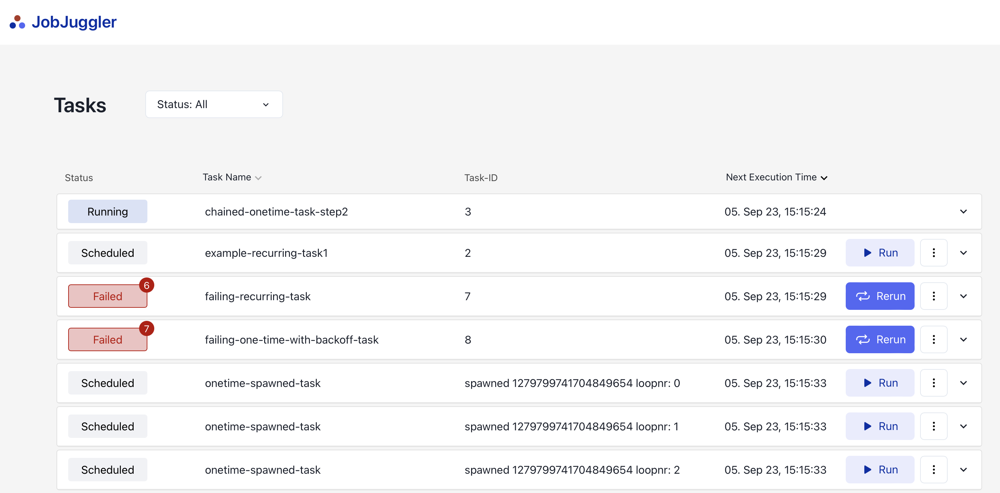

# DB Scheduler UI / JobJuggler

An UI extension of [db-scheduler](https://github.com/kagkarlsson/db-scheduler)

### React + TypeScript + Vite

## Features

* **Connects to bd-scheduler**. Connect to bd-scheduler to show a UI for your executions.
* **Uses SpringBoot to launch a UI**
* **Re-run or Run your task directly from the User Interface**
* **Sort task on Task Name or Execution Time**
* **View only TAsks that are Scheduled, Running or Failed.**
* **Delete Tasks**



## Table of contents

* [Getting started](#getting-started)
* [Prerequisites](#prerequisites)
* [How it works](#how-it-works)
* [Example](#example)
* [Configuration](#configuration)


## Getting started

1. Add maven dependency
```xml
<dependency>
    <groupId>com.github.bekk</groupId>
    <artifactId>db-scheduler-ui-starter</artifactId>
    <version>main-SNAPSHOT</version>
</dependency>
```
### Prerequisites

* An existing Spring Boot application, with [db-scheduler](https://github.com/kagkarlsson/db-scheduler)
* Minimum Java 11 and SpringBoot 2.7

## How it works


## Example

1. Install dependencies: `npm install`
2. Run the app: `npm run dev`
3. Run the backend `DemoApplication.java`
4. Open the app: http://localhost:51373


## Configuration