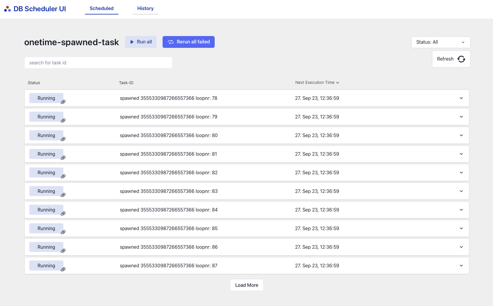
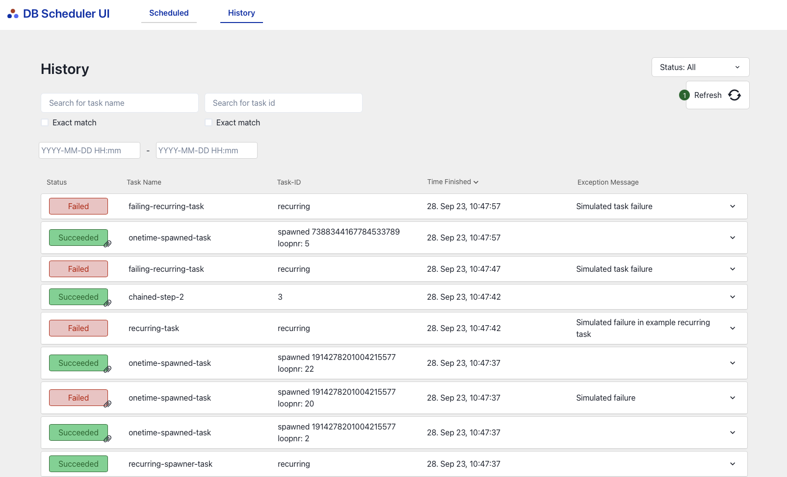

# DB Scheduler UI

[](http://www.apache.org/licenses/LICENSE-2.0.html)

A UI extension of [db-scheduler](https://github.com/kagkarlsson/db-scheduler)


## Features

* **Connects to db-scheduler** to show a UI for your executions.
* **Uses SpringBoot** to launch a UI
* **Re-run or Run** your task directly from the User Interface
* **Sort task** on Task Name or Execution Time
* **Search for Task** on name and task id 
* **View only Tasks that are Scheduled, Running or Failed.**
* **Delete Tasks** 
* **Polling** on Refresh button
* **View a log of all Tasks** if you have db-scheduler-log
 
DB-scheduler-UI is an extension of DB scheduler. 
It is built to give a visualization of the work done by DB scheduler. 
The UI can also display history if you are using the extension [db-scheduler-log](https://www.google.com/url?sa=i&url=https%3A%2F%2Fvectorportal.com%2Fno%2Fvector%2Fstrikking%2F35151&psig=AOvVaw3fCj7Z8BcYKAnS7_W48-4H&ust=1695901802129000&source=images&cd=vfe&opi=89978449&ved=0CBAQjRxqFwoTCOjb0dXcyoEDFQAAAAAdAAAAABAE).


In the UI you can Run scheduled Task now or Re-run tasks that have Failed, ```scheduler.reschedule(taskInstance, Instant.now());``` 
You can delete task form the scheduler, ```scheduler.cancel(taskInstance);``` The UI can display data contained in the task, or you can chose to turn this of. The UI will show what task have failed how many times and when the next execution time will be. If you have manny task with the same name, this will be shown as a group that can be extended to see all instances.


If you have the log extension the UI will display a History tab that shows all tasks that have run, both successful and failed. 
They can be sorted on time, filtered on failed/succeeded, or searched on task name, task instance and time interval. Failed task will when pressed show the stack trace of the exception.


---

---

---


## Table of contents

* [Getting started](#getting-started)
* [Prerequisites](#prerequisites)
* [How it works](#how-it-works)
* [Configuration](#configuration)

### Prerequisites

* An existing Spring Boot application, with [db-scheduler](https://github.com/kagkarlsson/db-scheduler)
* Minimum Java 11 and SpringBoot 2.7
* db-scheduler-log version 0.7.0
* Minimum db-scheduler version 12.5

## Getting started!

1. Add maven dependency
```xml
<dependency>
    <groupId>no.bekk.db-scheduler-ui</groupId>
    <artifactId>db-scheduler-ui-starter</artifactId>
    <version>$version</version>
</dependency>
```
```xml
<dependency>
    <groupId>io.rocketbase.extension</groupId>
    <artifactId>db-scheduler-log-spring-boot-starter</artifactId>
    <version>$version</version>
</dependency>
```


## How it works

Db-scheduler-UI adds a library that have a frontend application to show all Task in db-scheduler. 
The db-scheduler-ui backend is connected to the schedule-client. The backend fetches all executions, and 
they are sorted and filtered in the backend before it is displayed in the frontend app. 
As the backend connects to scheduler-client it is possible to run, re-run and delete task form the database in the application.

**To try it out you can branch the project and run the example-app.**
1. Install dependencies: npm install
2. Run the app: npm run dev
3. Run the backend DemoApplication.java
4. Open the app: http://localhost:51373


The URL connects to db-scheduler/**


## Configuration
In application.properties
If you have the extension db-scheduler-log you can turn on history. 
```
db-scheduler-ui.history=true
```
If you don't want to display data in the UI. Default is that Datashowing is on. 
```
db-scheduler-ui.task-data=false
```


