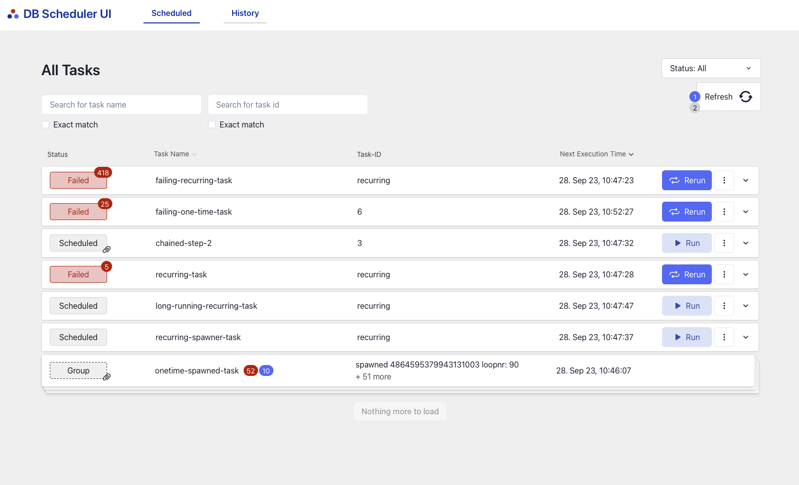
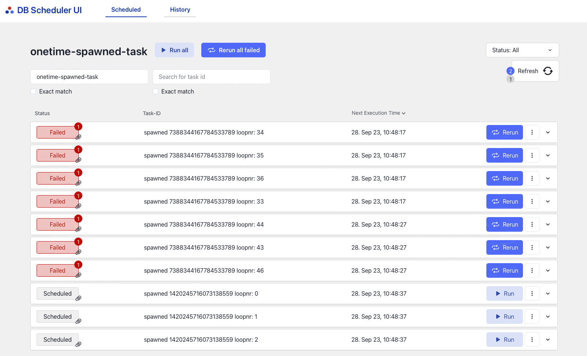

# DB Scheduler UI

[](http://www.apache.org/licenses/LICENSE-2.0.html)


A UI extension for [db-scheduler](https://github.com/kagkarlsson/db-scheduler) that provides a browser accessible 
dashboard for monitoring and basic administration of tasks.


## Features

* **View tasks** that are Scheduled, Running or Failed.
* **Re-run or Run** your task directly from the User Interface
* **Delete tasks**
* **Uses SpringBoot** to launch a UI
* **View the history of all tasks** (optional)





## Table of contents

* [Getting started](#getting-started)
* [Prerequisites](#prerequisites)
* [How it works](#how-it-works)
* [Configuration](#configuration)

### Prerequisites

* An existing Spring Boot application, with [db-scheduler](https://github.com/kagkarlsson/db-scheduler)
* Minimum db-scheduler version 12.5
* Minimum Java 11 and SpringBoot 2.7
* Optional (if you want task history): db-scheduler-log version 0.7.0


## Getting started
1. Add the db-scheduler-ui spring boot starter maven dependency
```xml
<dependency>
    <groupId>no.bekk.db-scheduler-ui</groupId>
    <artifactId>db-scheduler-ui-starter</artifactId>
    <version>1.0.0</version>
</dependency>
```

2. Read the [db-scheduler](https://github.com/kagkarlsson/db-scheduler) readme and follow the getting started guide. The most important is to create the `scheduled_tasks` table correctly.
   You do not need to add db-scheduler as a dependency.
3. Start your application. The db-scheduler UI can be reached at `<your-app-url>/db-scheduler`


## Optional: task history
If you want to add task history to your UI you need to add the following dependency:
```xml
<dependency>
    <groupId>io.rocketbase.extension</groupId>
    <artifactId>db-scheduler-log-spring-boot-starter</artifactId>
    <version>0.7.0</version>
</dependency>
```
Follow the [readme](https://github.com/rocketbase-io/db-scheduler-log) to create the correct database table.

You also need to set `db-scheduler-ui.history=true` in your application.properties file.


## How it works
db-scheduler-ui adds a REST-api package that has a bundled frontend application. 
Springboot is used to configure beans and handle dependencies within the library and your application.
The user interface makes calls to the scheduler-client, where it can fetch, delete, run, and reschedule tasks. 
These tasks are then shown in the web application. 
An optional log module can also be added, making it possible to view the history of all your task executions. 

## Configuration

db-scheduler-ui can be configured using the following options: <br>

Turns on db-scheduler-log, default value is false. See [Optional: task history](#optional-task-history)
```
db-scheduler-ui.history=false
```
<br>
If you for some reason want to hide the task data you can set this to false. defaults to true

```
db-scheduler-ui.task-data=true
```


## Contributing

Feel free to create pull requests if there are features or improvements you want to add. 
PR's need to be approved by one of the maintainers. To publish a new version, create a release in Github and tag it with a SemVer version.
A new release will then be released to maven central by a github action using JReleaser.

Before submitting a PR make sure to run `mvn spotless:apply` to format the code correctly.
Please use the prettier config when making frontend changes


## Local development
Prerequisites:
* Maven
* JDK11
* Node
* npm

There are two ways to run the frontend locally.
1. running `npm run dev` inside the db-scheduler-ui-frontend folder
2. running `mvn install` will build the frontend and copy the output to the resources folder in the `db-scheduler-ui` module. The frontend will then be available at the same port as the example app.

To run the backend run `mvn clean install` and then run the example app.
